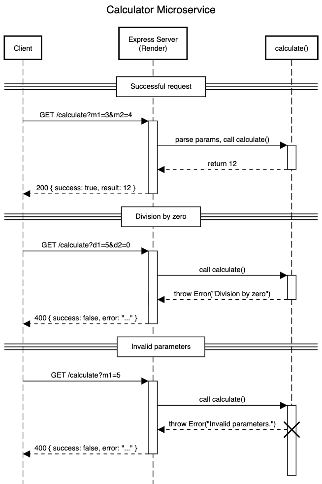

# CS361 Calculator Microservice README

## Description:

The Calculator Microservice provides simple arithmetic calculations through a REST API.

The service supports three operations:

1. **Multiplication**:
   Returns the product of two integers
2. **Division**:
   Returns the quotient of two integers
3. **Progress Calculation**:
   Returns the quotient of two integers multiplied by another integer. This can be used to calculate percentages or progress values.

---

## Running the Microservice

Install dependencies:

```
npm install
```

## Start the server

```
npm start
```

The server runs locally at on:

```text
http://localhost:3000/
```

Cloud deployment (Hosted on Render):

```text
https://cs361-calculator-microservice.onrender.com/calculate
```

---

# Requesting Data

Send a GET request to:

```http
/calculate
```

## Valid Query Parameters

| Operation            | Example Request                 |
| -------------------- | ------------------------------- |
| Multiplication       | `/calculate?m1=5&m2=4`          |
| Division             | `/calculate?d1=20&d2=5`         |
| Progress Calculation | `/calculate?m1=100&d1=25&d2=50` |

## Example Call

Local

```bash
curl "http://localhost:3000/calculate?m1=6&m2=4"
```

Cloud

```bash
curl "https://cs361-calculator-microservice.onrender.com/calculate?m1=6&m2=4"
```

---

# Receiving Data

The microservice returns JSON.

## Success Response

```json
{
  "success": true,
  "result": 20
}
```

## Error Response

```json
{
  "success": false,
  "error": "Division by zero not allowed"
}
```

---

## UML Sequence Diagram




## Testing the Microservice 

If you don't feel like running this, just paste this into your browser's address bar to test:
```
https://cs361-calculator-microservice.onrender.com/calculate?m1=5&m2=10&d1=4&d2=2
```
Format the output of your monolith to mirror the structure of the url above.
You must have either:  <br />
&ensp;- m1 and m2 (for multiplication) <br />
&ensp;- d1 and d2 (for division) <br />
&ensp;- m1, d1, and d2 (for combined) <br />
Any other combination of parameters will return an error message.
You can also test division by zero by setting d2 to 0, which should also return an error message.
